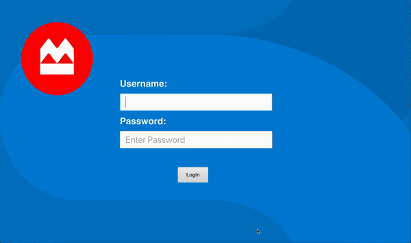
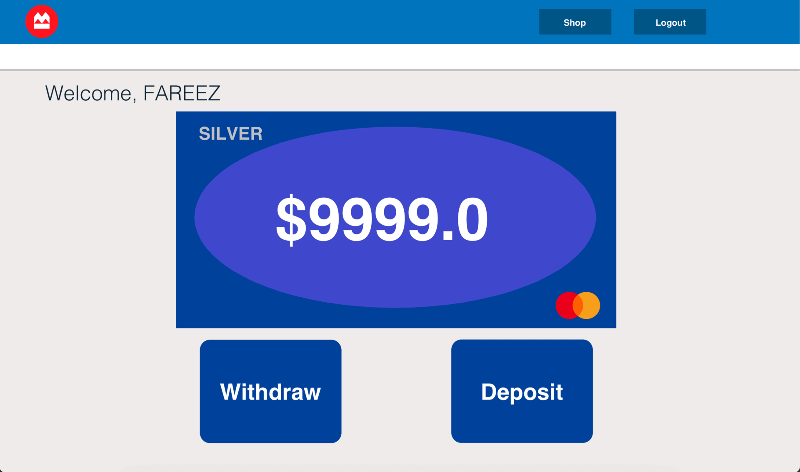

# Bank Application Project

**Name**: Fareez Mir   

## Overview

The Bank Application is a JavaFX-based banking system simulation developed as part of a university project. The application allows users to log in as either a Manager or a Customer. Managers can manage customer accounts, while Customers can perform various banking operations such as viewing their balance, making deposits, withdrawing money, and purchasing items online. The application is designed with object-oriented principles and incorporates design patterns to ensure robust and maintainable code.



## Features

- **Manager Functions**: 
  - Add and delete customer accounts.
  - Login and logout of the system.
  - Manage customer data efficiently.
  
- **Customer Functions**:
  - Login and logout of the system.
  - View account balance.
  - Deposit and withdraw money.
  - Make online purchases with account validation.
  - Dynamic account level management based on balance.



## Project Structure

### 1. Use Case Diagram

The use case diagram for the bank application showcases interactions between users and the system. The application consists of two primary actors: the Manager and the Customer. 

- **Manager**: 
  - Can "AddCustomer" and "DeleteCustomer".
  - Can "Login" and "Logout" of the system.

- **Customer**: 
  - Can "Login" and "Logout".
  - Can "ViewBalance", "DepositMoney", "WithdrawMoney", and make "OnlinePurchase".
  - Each transaction is validated to ensure secure and accurate processing.

### 2. Class Diagram

The class diagram outlines the structure and relationships between the classes within the system, highlighting the interaction between different components:

- **Customer**: Manages customer-related data and operations.
- **CustomerState**: Interface representing different account levels (Silver, Gold, Platinum).
- **ManagerScene**: Contains Manager-specific functionalities.
- **CustomerScene**: Manages customer-related operations, including balance updates and transactions.
- **LoginMenu**: Provides the initial interface for user authentication.
- **SceneHub**: Acts as a controller for transitioning between different scenes in the application.
- **ShoppingScene**: Manages the shopping operations for customers, including handling purchases and updating customer data.

### 3. State Design Pattern

The application leverages the State Design Pattern to dynamically manage customer account levels. The `CustomerState` interface, along with its implementations (`CustomerSilver`, `CustomerGold`, `CustomerPlatinum`), enables smooth transitions between account levels based on the customer’s balance. This design pattern ensures flexibility and allows the system to adjust the customer’s benefits and fees according to their account status.

## How to Run

1. **Clone the repository**:
    ```bash
    git clone https://github.com/yourusername/bank-application.git
    ```
2. **Open the project in your favorite Java IDE (e.g., IntelliJ IDEA, Eclipse)**.
3. **Build and run the project**:
    - Ensure that JavaFX is correctly set up in your environment.
    - Run the `BankApplication` class to start the application.

## Future Improvements

- **Enhanced Security**: Implement multi-factor authentication for both Managers and Customers.
- **Implement More Features**: Introduce new features such as interest calculation, and loans.
- **Improved UI/UX**: Refine the user interface for a more intuitive and responsive experience by simplifying code.

---

Thank you for checking out the Bank Application Project! Feel free to explore the code and suggest any improvements.

